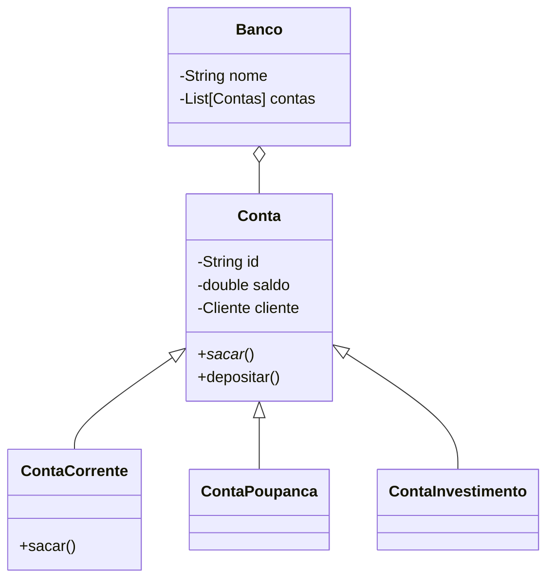

## Docker

Docker compose

```bash title="Executar no diretório do arquivo compose.yaml"
docker compose up -d
```

```bash title="Executar no diretório do arquivo compose.yaml"
docker compose down
```

docker ps -a


